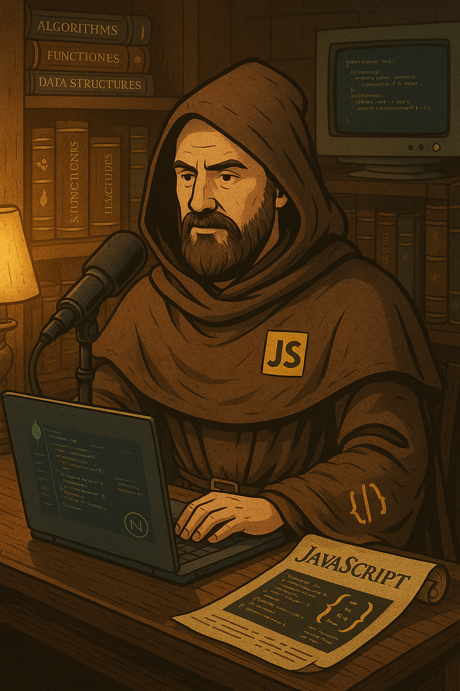

    <h2 align="center" style="border:none"> O.O. Quest – A Irmandade dos Objetos</h2>
    <h3 align="center">A jornada pelos quatro pilares da O.O.</h3>
    <h3 align="center">Apresentado por: Alisson Rangel</h3>

 

    preview do podcast

    <audio src="./output/podcast_editado_01.mp3" controls title="Podcast editado"></audio>

## Projeto Podcast Gerado por I.A.s

### Este é o repositório desenvolvido por <strong style="font-size: 20px">Alisson Rangel</strong> para concretizar o desafio de projeto de um Bootcamp da DIO.

Projeto com o objetivo de gerar um podcast utilizando ferramentas de IA através de prompts mais trabalhados.

Utilizei uma sequência de prompts para gerar o título, subtítulo o roteiro, a locução e a imagem.

## 💻 Tecnologias utilizadas no projeto

- [ChatGPT](https://chat.openai.com/) 
- [ElevenLabs](https://beta.elevenlabs.io/)
- [Capcut](https://www.capcut.com/pt-br/)

## ✨ Como foi feito ?

- Roteiro e Título gerado via ChatGPT;
- Audio gerado pela elevenLabs com base no roteiro do ChatGPT;
- Não consegui gerar a arte do podcast no MidJourney, então utilizei o ChatGPT para gerar uma imagem;
- Baixei o programa do Capcut para meu laptop para tratar aúdio e adicionar som de fundo.