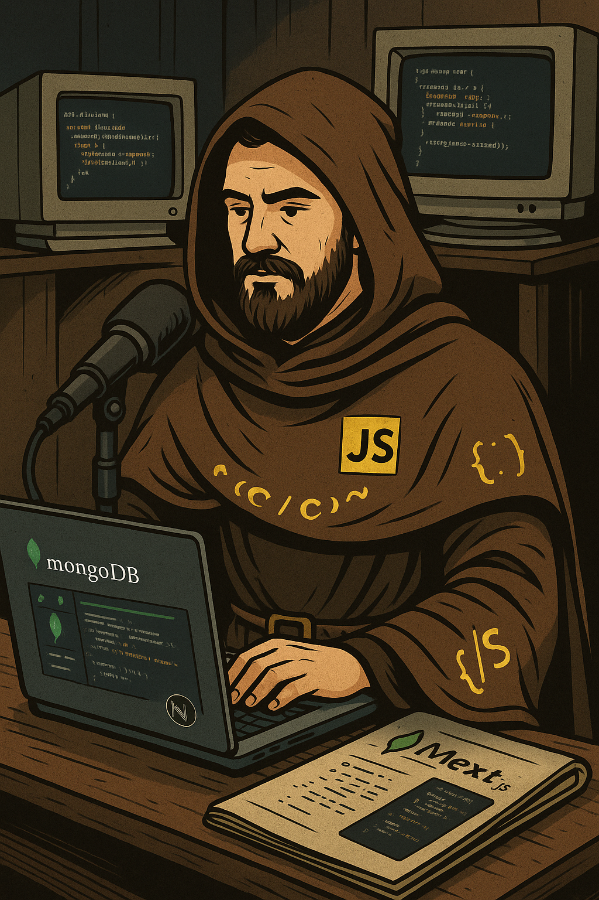

## 🧠 Prompts


ChatGPT：

### Título
```markdown
Você é um roteirista de podcast, e vamos criar um podcast de tecnologia, focado em backend e eu gostaria de uma ajuda sua para criar 10 sugestões de nomes criativos para um podcast de backend feito por especialistas sêniores em javascript. 
O podcast vai falar sobre como aprender Orientação a Objetos utilizando a linguagem javascript. 

{REGRAS} 
- O nome deve ter até 7 palavras com um subtítulo. 
- O nome tenha algum trocadilho nerd com nomes de franquias conhecidas como cavaleiros do zodíaco, os vingadores, senhor dos anéis. 
- O nome deve conter alguma palavra forte que faz referência a O.O. com javascript. 

{REGRAS NEGATIVAS} 
- Não quero que utilize nenhuma das palavras nessa lista: backend, programador, desenvolvedor 
- Não utilize a palavra backend no nome nem qualquer variação dela

```

### Conteúdo
```markdown
Você é um roteirista de podcast, e vamos criar um  roteiro de um podcast de tecnologia, focado em backend cujo o nome é "O.O. Quest - A Irmandade dos Objetos" com o subtítulo: "A jornada pelos quatro pilares da O.O.",  com o público alvo de iniciantes em backend. O objetivo do podcast é ensinar os quatro pilares da Orientação a Objetos utilizando a linguagem javascript.

o formato do roteiro deve ser
[INTRODUÇÃO]
[CURIOSIDADE]
[EXPLICAÇÃO]
[FINALIZAÇÃO]

{REGRAS}
- no bloco [INTRODUÇÃO] substitua por uma introdução iguais as introduções dos vídeos do canal 'ei nerd', como se fossem escritos pelo Peter Jordan;
- no bloco [CURIOSIDADE] substitua por uma curiosidade de javascript com o foco em um dos pilares da O.O.;
- no bloco [EXPLICAÇÃO] explique o pilar da O.O. que foi abordado em [CURIOSIDADE], de uma maneira simples e direta como se fosse uma explicação do canal 'Código Fonte TV';
- no bloco [FINALIZAÇÃO] substitua por uma despedida cool com o final 'Este foi o conteúdo do episódio de hoje, espero que tenham gostado, até a próxima!';
- use termos de fácil explicação;
- O podcast vai ser apresentado somente por uma pessoa, chamada Alisson Rangel;
- O podcast deve ser curto.

{REGRAS NEGATIVAS}
- Não use muitos termos sêniores na elaboração do conteúdo;
- Não ultrapasse 5 minutos de duração.
```

### Imagem - fiz no CahtGPT mesmo, pois não consegui gerar no MidJourney
#### Prompt inicial
```markdown
Crie um locutor de podcast no estilo medieval, mas envolta de um laptop e com um microfone.
```


#### Prompt adicional para alterar a imagem
```markdown
crie a mesma imagem só que em vez de mongoDB coloque javascript
```

